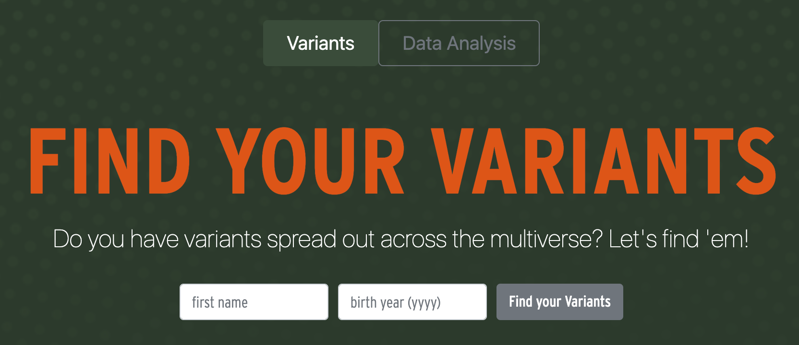
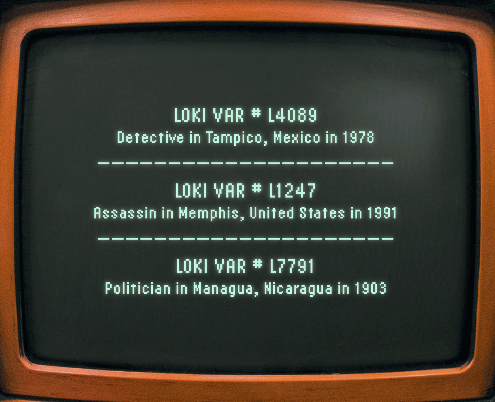
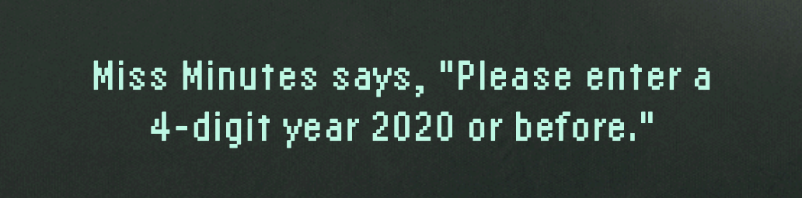

# Flask App

Check out the live site [here](http://findyourvariants.herokuapp.com/).

**Loki has variants, do you?**

Inspired while watching an episode of the show ***Loki*** where the Time Variance Authority displays a few of his variants with id #s on screen, I wanted to create a fun website to mimic the show's idea of everyone having variants in the multiverse while utilizing some of the skills I have in Python, JavaScript and using an API call to interact with data. 

## How It Works
The app works by taking the user inputs of name and year of birth, creates an API call to feed into a Python function, which generates a dictionary that the JavaScript d3 program writes to the website. It uses a list of jobs and location options, generates a dictionary of three variants which come together by creating random 4-digit numbers linked to the first letter of the input name for the variant id#, then three random jobs and locations, and random years based off creating a list using the user input year. 

What you get is a dictionary of three variants for the person. You can click the Find My Variants! button repeatedly to continue to generate new options. 

## Development Process
As a test of concept, I wrote the program in a Jupyter Notebook using imported csv files of jobs and cities that I had created. Then I created the html homepage mockup of what I wanted the user interface to be, which helped me to draw the roadmap of how to get there. I then created a Flask App and connected to the Heroku site. In order to test the python code was working—without the inputs being fed from the website yet—I created default values inside the Python function. 

Next, I worked out the JavaScript code for the event handler that would write the returned JSON dictionary to the "screen" I had designed on the website. I did also spend a bit of time learning some css and getting the site to have a similar look and feel to the Loki tv show. I edited a free image with Photoshop, and also connected to Adobe Typekit fonts to get the look right and used a Bootstrap framework for the html and css making the webiste responsive. So once the app was up and working locally, I connected to the sql database hosted on Heroku through pgAdmin 4 and built the databases so it was hosted online and not using the sqlite file I had made as backup. 

 

Lastly, I went back and worked on error handling for user input issues realizing I needed to return a series of if/else statements to mitigate any user errors. For example, if you enter a year in the future or forget to input one of the fields you'll get a warning message from Miss Minutes.

I also created a page for data analysis to showcase various Tableau charts I created using Marvel films data. For example, illustrating how much screentime Loki had in each film. 

Fun to go through the process of coding the website, and mainly hope it's enjoyable to use!

